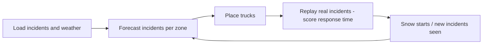

# Stormstage
# Case 6 (Option A) - Where should the tow trucks wait when it snows?

**Stream:** Software and Computational Math  
**Track:** Option A - own problem, public data  
**Team:** Admest FC - Thamer Elsadek, Salif Sylla, Adam Bensidi

---

## The problem (in plain words)

On a normal day Calgary logs about **20** reported traffic incidents. On a snow day it can be **four times** that - the worst day in the 2025 open data (4 Feb 2025) had **85**.

Tow and roadside trucks usually wait at the same yards all day. When the snow starts, the crashes pile up in a few parts of the city while trucks sit across town. Drivers wait, lanes stay blocked, and more crashes follow.

You are **not** running a full traffic model. You are deciding **where a small fleet of trucks should wait, hour by hour**, using incident history and the weather.

**Our challenge:** Forecast where incidents will happen in the next few hours. Place 6 trucks to be closest to them. Beat "trucks stay at fixed yards" on a replay of a real snow day. Then **re-plan when the snow starts** and show response time drop.

---

## Who would use this

A roadside-assistance or tow fleet (for example AMA roadside or a Calgary tow company), or the City of Calgary Traffic Management Centre. They are selling **faster response with the same number of trucks** on the worst days of the year.

---

## Steps

1. Load Open Calgary traffic incidents (2025) and ECCC hourly weather for Calgary International. Join on date-hour.
2. Split the city into zones (about a 2 km grid). Count incidents per zone per hour.
3. Forecast incidents per zone for the next 3 hours from hour of week + weather (snowing, below 0 °C). Baseline forecast: same hour last week.
4. Place 6 trucks to cut expected drive time (greedy placement + one swap pass). Baselines: **fixed yards**, and **last week's hotspots**.
5. Replay a real snow day. Nearest free truck goes to each real incident. Score average and 90th-percentile response minutes, and % reached within 15 minutes.
6. Every hour (and when snow starts), add the incidents seen so far, re-forecast, and move trucks only if it saves more time than the move costs. Log one reason per move.
7. Report baseline vs StormStage on the demo day and 2 held-out storm days.

---

## Picture of the loop

The baseline (fixed yards) is scored by the **same replay**, on the **same incidents**, so the comparison is fair.

---

## New words

| Word | Meaning |
|---|---|
| Zone | One square of the city grid (about 2 km) where we count incidents |
| Staging | Where a truck waits before it is called |
| p-median | Pick k spots so the average trip to the demand is as short as possible |
| Response time | Minutes from incident start until the nearest free truck arrives |
| 90th percentile | The response time that 9 out of 10 incidents beat - shows the bad waits |
| Move penalty | A cost for relocating a truck, so it only moves when it is worth it |

---

## Watch or read (optional)

- [City of Calgary - Priority Snow Plan](https://www.calgary.ca/roads/conditions/sanding-plowing-priorities.html)
- [Facility location problem (Wikipedia)](https://en.wikipedia.org/wiki/Facility_location_problem)
- [Poisson regression (Wikipedia, short)](https://en.wikipedia.org/wiki/Poisson_regression)

---

## Start here

1. Open a terminal **in this folder**.
2. `pip install -r requirements.txt`
3. `streamlit run app.py`
4. Pick a storm day, press play, and compare the left map (fixed yards) with the right map (StormStage).

Data notes: [`data/README.md`](data/README.md). **Python 3.10+** (3.11 is best).
