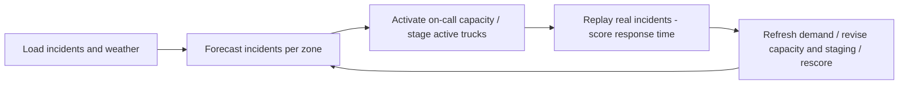

# StormStage
# Option A - Where should the tow trucks wait when it snows?

**Stream:** Software and Computational Math  
**Track:** Option A - own problem using public data\
**Team:** Admest FC - Thamer Elsadek, Salif Sylla, Adam Bensidi

---

## The problem (in plain words)

On a normal day Calgary logs about **20** reported traffic incidents. On a snow day it can be **four times** that - the worst day in the 2025 open data (4 Feb 2025) had **85**.

Tow and roadside trucks usually wait at the same yards all day. When the snow starts, the crashes pile up in a few parts of the city while trucks sit across town. Drivers wait, lanes stay blocked, and more crashes follow.

You are deciding **when to activate on-call capacity and where active trucks should wait, hour by hour**, using incident history and the weather.

**Our challenge:** Forecast demand for the next few hours. Start with **6 base trucks**, activate **up to 4 additional on-call trucks** when forecasted demand indicates a surge, and stage/re-stage active trucks near expected demand. Compare against **Fixed yards (naive)**, with **Best fixed plan** as a stronger secondary comparator, through **plan → score → revise → rescore**.

**Why the design changed:** Testing re-staging with the same six trucks showed little advantage over fixed staging, so the team revised the policy to forecast-triggered on-call capacity. Current [B results](results/RESULTS.md) and app replays use B's **stand-in forecast**. A's real weather-driven forecast is **not yet integrated**; final weather-driven results remain **[PENDING]**.

---

## Who would use this

A roadside-assistance dispatcher or Calgary tow operator is the intended user; AMA roadside and the City's Traffic Management Centre are examples of potential users. The goal is faster response through better capacity timing and staging. No customer, partner, deployment, or operational validation is established.

---

## Steps

The final weather-driven workflow is below; current replays use the stand-in forecast.

1. Load Open Calgary reported traffic incidents (2025) and ECCC hourly weather for Calgary International. Join on date-hour, keeping UTC source times and Calgary local replay times aligned.
2. Split the city into zones (about a 2 km grid). Count incidents per zone per hour.
3. Forecast incidents per zone for the next 3 hours from hour of week + weather (snowing, below 0 °C). Baseline forecast: same hour last week.
4. Start with 6 base trucks; activate up to 4 on-call trucks when forecasted demand indicates a surge. Stage active trucks to cut expected drive time (greedy placement + one swap pass). Primary baseline: **Fixed yards (naive)**. Stronger secondary comparator: **Best fixed plan**.
5. Replay a real snow day. Nearest free truck goes to each real incident. Score average and 90th-percentile response minutes, and % reached within 15 minutes.
6. Every hour, use incidents seen so far to refresh the forecast, revise on-call capacity and staging, and move trucks only when the expected saving justifies the move penalty. Log activation and move reasons, then rescore.
7. Report response metrics and truck-hours against both comparators. B's stand-in evaluation covers 12 held-out storm days and 8 normal days; rerun with A's real forecast before filling **[FINAL WEATHER-DRIVEN RESULTS]**.

---

## Picture of the loop

**Fixed yards (naive)** and **Best fixed plan** use 6 trucks. StormStage uses 6 base trucks plus up to 4 on-call trucks. Score the **same incidents** with shared dispatch, travel, and service assumptions, and report truck-hours alongside response times so the capacity cost is visible.

---

## New words

| Word | Meaning |
|---|---|
| Zone | One square of the city grid (about 2 km) where we count incidents |
| Staging | Where a truck waits before it is called |
| On-call capacity | Up to 4 additional trucks activated when forecasted demand indicates a surge |
| p-median | Pick k spots so the average trip to the demand is as short as possible |
| Response time | Minutes from incident start until the nearest free truck arrives |
| 90th percentile | The response time that 9 out of 10 incidents beat - shows the bad waits |
| Move penalty | A cost for relocating a truck, so it only moves when it is worth it |

---

## Watch or read (optional)

- [City of Calgary - Priority Snow Plan](https://www.calgary.ca/roads/conditions/sanding-plowing-priorities.html)
- [Facility location problem (Wikipedia)](https://en.wikipedia.org/wiki/Facility_location_problem)
- [Poisson regression (Wikipedia, short)](https://en.wikipedia.org/wiki/Poisson_regression)

---

## Start here

1. Open a terminal **in this folder**.
2. `pip install -r requirements.txt`
3. `streamlit run app.py`
4. Pick a storm day and use the hour slider to compare **Fixed yards (naive)** with **StormStage + on-call**. Play/Pause is a placeholder. The policy dropdown also exposes **Best fixed plan**.

The app shows **PRECOMPUTED / INTERIM** stand-in replays. Its metrics are full-day summaries, independent of the hour slider, and are not final weather-driven performance. Backend/evidence notes: [B_PLACEMENT_SIMULATOR.md](B_PLACEMENT_SIMULATOR.md). Final dataset documentation remains pending (`data/README.md` is absent). **Python 3.10+** (3.11 is best).
