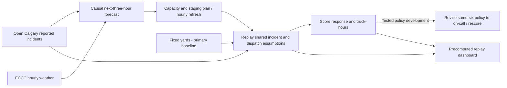

# StormStage
# Option A - Where should the tow trucks wait when it snows?

**Stream:** Software and Computational Math  
**Track:** Option A - own problem using public data\
**Team:** Admest FC - Thamer Elsadek, Salif Sylla, Adam Bensidi

---

## The problem (in plain words)

Winter weather can push reported incident demand beyond a small fleet's capacity. Open Calgary records represent **reported traffic incidents**, including traffic-signal issues, **not all collisions or all tow calls**.

StormStage explores when to add on-call capacity and where active tow and roadside trucks should wait. Fixed waiting locations provide the primary comparison; response and capacity trade-offs are tested in simulation.

You are deciding **when to activate on-call capacity and where active trucks should wait, hour by hour**, using incident history and the weather.

**Our challenge:** Forecast demand for the next few hours. Start with **6 base trucks**, activate **up to 4 additional on-call trucks** when forecasted demand indicates a surge, and stage/re-stage active trucks near expected demand. Compare against **Fixed yards (naive)**, with **Best fixed plan** as a stronger secondary comparator, through **plan → score → revise → rescore**.

**Why the design changed:** The original same-six-truck re-staging hypothesis did **not** improve the fixed baselines on aggregate storm-day average response. The team revised the policy to forecast-triggered on-call capacity. A's causal weather-driven forecast is integrated; the current evaluation and precomputed replays use forecast source `a`.

## Measured weather-driven results

These are **simulated replay outcomes, not field-deployment results**. The following aggregates are means of per-day metrics across **12 designated storm test days using a causal forecast**, from [test_summary.csv](results/test_summary.csv). The p90 column is the mean of daily p90 values, not a pooled incident percentile.

| Policy | Average response (min) | Daily p90 (min) | Within 15 min (%) | Truck-hours/day |
| --- | --- | --- | --- | --- |
| Fixed yards (naive) — primary baseline | 14.1 | 27.1 | 68.2 | 144 |
| Best fixed plan — secondary comparator | 13.7 | 26.1 | 70.9 | 144 |
| StormStage (same 6 trucks) | 14.2 | 27.1 | 68.8 | 144 |
| StormStage + on-call | 10.6 | 18.9 | 79.3 | 176.5 |
| Fixed 10 trucks all day | 7.5 | 13.1 | 93.3 | 240 |

StormStage + on-call lowered simulated average response from **14.1 to 10.6 minutes** against Fixed yards (naive), and beat it on **10 of 12** storm test days; it beat Best fixed plan on **8 of 12** ([win counts](results/RESULTS.md)). Keeping all ten trucks active all day was faster, but used **240 truck-hours/day**, compared with **176.5** for on-call. Truck-hours measure capacity use; they do not establish monetary savings.

**Feb 4 demo day only:** Fixed yards (naive) averaged **20.1 minutes**, versus **9.8 minutes** for StormStage + on-call. These full-day values are separate from the 12-day aggregate above; see [per-day results](results/test_by_day.csv) and [demo replay metrics](data/processed/replay/2025-02-04/metrics.json).

**Evaluation methodology:** Evaluation uses a causal rolling-origin / out-of-time forecast. For each replay date, A fits only on information available before the requested UTC date. Earlier evaluation dates may become historical training data for later replay dates, so this is not a single frozen holdout set. `forecast.py` explicitly excludes Feb 4, Feb 14, and Nov 24 plus each following UTC date. Policy settings were selected on separate tuning days. The 12 storm and 8 normal evaluation dates were not all excluded from A's training.

---

## Who would use this

A roadside-assistance dispatcher or Calgary tow operator is the intended user; AMA roadside and the City's Traffic Management Centre are examples of potential users. The goal is faster response through better capacity timing and staging. No customer, partner, deployment, or operational validation is established.

---

## Steps

The integrated weather-driven workflow is below.

1. Load Open Calgary reported traffic incidents (2025) and ECCC hourly weather for Calgary International. Join on date-hour, keeping UTC source times and Calgary local replay times aligned.
2. Split the city into zones (about a 2 km grid). Count incidents per zone per hour.
3. Forecast citywide incidents for the next 3 hours with a causal Poisson model using UTC hour of week and current weather, then allocate demand to historical zone shares. Current weather is persisted over the horizon; future observed weather is not read. `baseline_forecast` is a separate prior-week demand reference, not a truck policy.
4. Start with 6 base trucks; activate up to 4 on-call trucks when forecasted demand indicates a surge. Stage active trucks to cut expected drive time (greedy placement + one swap pass). Primary baseline: **Fixed yards (naive)**. Stronger secondary comparator: **Best fixed plan**.
5. Replay recorded storm-day incidents using nearest-arrival dispatch. Score average and 90th-percentile response minutes, and % reached within 15 minutes.
6. Every hour, refresh weather-driven demand and the surge signal: the larger of weather lift (real-weather forecast versus calm-weather forecast) and a recent-incident nowcast. Revise capacity and staging; relocate only when expected savings justify the move penalty. Record activation, stand-down, and move reasons.
7. Score the completed replay and compare response metrics and truck-hours across policies on 12 designated storm days and 8 normal days. **PLAN → SCORE → REVISE → RESCORE** also describes the tested policy revision from same-six-truck staging to on-call capacity. The dashboard navigates saved snapshots and full-day scores; it does not run this computation when the slider moves.

---

## Picture of the loop

**Fixed yards (naive)** and **Best fixed plan** use 6 trucks. StormStage uses 6 base trucks plus up to 4 on-call trucks. Score the **same incidents** with shared dispatch, travel, and service assumptions, and report truck-hours alongside response times so the capacity trade-off is visible.

---

## New words

| Word | Meaning |
|---|---|
| Zone | One square of the city grid (about 2 km) where we count incidents |
| Staging | Where a truck waits before it is called |
| On-call capacity | Up to 4 additional trucks activated when forecasted demand indicates a surge |
| p-median | Pick k spots so the average trip to the demand is as short as possible |
| Response time | Minutes from incident start until the nearest free truck arrives |
| 90th percentile | The response time that 9 out of 10 incidents beat - shows the bad waits |
| Move penalty | A cost for relocating a truck, so it only moves when it is worth it |

---

## Watch or read (optional)

- [City of Calgary - Priority Snow Plan](https://www.calgary.ca/roads/conditions/sanding-plowing-priorities.html)
- [Facility location problem (Wikipedia)](https://en.wikipedia.org/wiki/Facility_location_problem)
- [Poisson regression (Wikipedia, short)](https://en.wikipedia.org/wiki/Poisson_regression)

---

## Start here

1. Open a terminal **in this folder**.
2. Create and activate a virtual environment: `python -m venv .venv` (Windows: `.\.venv\Scripts\Activate.ps1`).
3. `python -m pip install -r requirements.txt`
4. `python -m streamlit run app.py`
5. **Presentation Mode** opens at **Feb 4, 2025, 01:00** with StormStage + on-call. Move **Replay hour** to 00:00 to show six base trucks, then 01:00 for the recorded four-truck activation. At 04:00 the cards show the current fleet and historical trigger; at 22:00 they show the stand-down.
6. Scroll through the selected-day response/capacity band, 12-day evidence, and **PLAN → SCORE → REVISE → RESCORE**. Technical logs and coordinate tables are collapsed.
7. **Explorer Mode** provides every exported date and all six policies, detailed tables, decision logs, and optional side-by-side maps.

The badge identifies a **weather-driven precomputed simulation** in **Calgary local time (America/Edmonton)**. Truck positions are snapshots at the hour's start; reported incidents and decision-log entries extend through that hour's end. Result bands are full-day simulated summaries, independent of the slider. The manual slider navigates saved output. Map backgrounds require internet; local replay data and scores do not.

Use **Python 3.10+**; the release was verified with **Python 3.14.3**. For checks, install `pytest`, run `python -m src.prepare_data` to regenerate the ignored zone-hour intermediate, then `python -m pytest -q`. See [final handoff](docs/final-handoff.md) for clean-clone results and exact commands, [demo runbook](docs/demo-runbook.md) for the presentation, and [judge Q&A](docs/judge-qa.md) for evidence boundaries. Backend notes: [B_PLACEMENT_SIMULATOR.md](B_PLACEMENT_SIMULATOR.md); data preparation: [data/README.md](data/README.md).

UI rendering lives in `app.py`, styles in `dashboard.css`, and read-only state/result calculations in `dashboard_data.py`. Backend algorithms, validated datasets, replay exports, and result numbers are unchanged. Actual dashboard captures are in [final_demo_assets](final_demo_assets/README.md).
