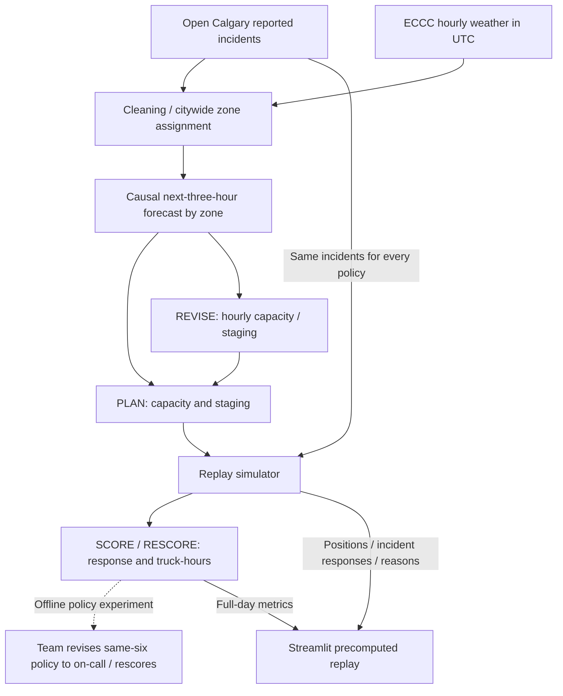

# StormStage architecture specification

Reviewed October 4, 2026 against evidence base `03d52e6`; UI release validation is recorded in [final handoff](final-handoff.md). Sources: [forecast implementation](../forecast.py), [data documentation](../data/README.md), [aggregate results](../results/test_summary.csv), [result report](../results/RESULTS.md), and tracked backend, replay exports, and dashboard. A's causal weather-driven forecast is integrated, and evaluation/replays use source `a`.

The adopted policy uses **6 base trucks + up to 4 forecast-triggered on-call trucks**, with active trucks staged near expected demand. The original same-six-truck re-staging hypothesis did not improve aggregate storm-day average response over the fixed baselines. The team revised the policy and rescored it with on-call capacity.

## Integrated flow

**PLAN → SCORE → REVISE → RESCORE** is supported by the policy comparison: plan with the same six trucks, score that hypothesis, revise to forecast-triggered on-call capacity, and rescore. Within each replay the backend refreshes demand and revises capacity/staging hourly. Response scores are computed from replay outcomes; they are not an online feedback signal in the optimizer. The dashboard reads saved snapshots and full-day metrics, so moving its slider does not run a forecast, optimizer, simulator, or per-step rescore.

## Component status

A = Data & Forecast; B = Optimizer & Simulator; C = App, Voice & Pitch Lead. Status describes repository evidence, not deployment validation.

| Component | Current implementation / evidence |
| --- | --- |
| Incidents and weather | Open Calgary raw/cleaned incident files and ECCC hourly weather are tracked. A's processed UTC joins and weather indicators are documented in `data/README.md`; B loads replay incidents via `common.py`. |
| Citywide zones | A's model and B/C use `data/processed/zones_grid.csv`: 179 zones. Root `zones.csv` is a legacy file, not the current forecast path. |
| Forecast | `forecast.py` fits causal citywide Poisson demand and allocates it to historical zone shares. `forecast_adapter.py` connects source `a` to B. |
| Placement / hourly revision | `place.py` implements greedy p-median plus swaps and a move penalty; `simulate.py` handles staging, activation, stand-down, and dispatch. |
| Replay / scoring | `simulate.py`, `evaluate.py`, and `export_replay.py` produce response metrics, capacity use, actions, and timelines. `results/test_summary.csv` reports storm and normal evaluation summaries. |
| Dashboard | `app.py` reads `replay_data.py` for selected-day positions, decisions, incidents, and full-day metrics. Presentation Mode defaults to Feb 4 at 01:00. A manual timeline controls a single operations map, current fleet cards, historical decision context, response/capacity results, aggregate evidence, and the tested policy-revision strip. Explorer retains all replay policies and detailed data. No demand heatmap or voice control is implemented. |

## Interfaces and assumptions

| Interface | Output / current behavior |
| --- | --- |
| `forecast(day, hour, weather)` | `zone_id, expected_incidents` for the next three UTC hours, including midnight rollover. Weather keys are `snowing`, `temp_c`, `snow_last_6h`. |
| `baseline_forecast(day, hour)` | Observed per-zone counts in the same three UTC hours seven days earlier; a demand reference, not a truck policy. |
| `place_trucks(demand, T, k, current, move_penalty_min)` | Staging sites and relocation reasons for the active fleet. |
| `simulate(...)`, `truck_positions(...)` | Per-incident response log, capacity/move actions, and truck timelines; exported snapshots use five-minute steps. |
| `metrics(log)`, `replay_data.get_metrics(day, policy)` | Mean response, p90, within-15 share, plus exported relocations, activations, and truck-hours. Dashboard metrics are full-day values from replay exports. |

**Forecast:** fitting stops before the requested UTC decision date. The model uses hour of week, reported snow, below-zero temperature, and preceding-six-hour snow; missing temperature uses the training median. Supplied current weather is persisted over the horizon. City demand is allocated to historical zone shares, which remain fixed within a UTC fitting date; this is not a model of zone-specific weather effects.

**Time:** raw data, A's joins, and forecast inputs use UTC. B's simulation and C's replay use Calgary local time (`America/Edmonton`); the adapter converts local decision time back to UTC for A.

**Capacity:** the selected on-call policy permits four extra trucks at a surge threshold of 2.0. The surge signal is the larger of weather lift (real-weather versus calm-weather forecast) and a recent-incident nowcast. It is not simply forecast divided by last week's count. The adapter records fallback hours if A cannot run; B's integration notes report none on the evaluation days.

**Replay assumptions:** nearest-arrival dispatch; straight-line distance × 1.3 at 40 km/h; 30 minutes on scene. Returning/relocating trucks can be dispatched from interpolated positions. These are shared simulation assumptions, not calibrated field response times. Truck-hours are capacity use, not a monetary cost estimate.

**Metrics:** response time is incident start to truck arrival. Aggregates in `test_summary.csv` are means of daily metrics, including daily p90 and within-15 shares; they are not pooled incident statistics. Slider-visible incident rows contain completed response outcomes, including arrivals after the selected hour.

## Measured policy revision

Evaluated across **12 designated storm test days using a causal forecast**:

- **Fixed yards (naive), primary baseline:** 14.1-minute average response, 27.1-minute mean daily p90, 68.2% within 15 minutes, 144 truck-hours/day.
- **Best fixed plan, secondary comparator:** 13.7 minutes, 26.1 minutes, 70.9%, 144 truck-hours/day.
- **StormStage (same 6 trucks):** 14.2 minutes, 27.1 minutes, 68.8%, 144 truck-hours/day. It did not improve the baselines' aggregate average response.
- **StormStage + on-call:** 10.6 minutes, 18.9 minutes, 79.3%, 176.5 truck-hours/day; lower average response than Fixed yards on 10 of 12 days and Best fixed plan on 8 of 12.
- **Fixed 10 trucks all day:** 7.5 minutes, 13.1 minutes, 93.3%, 240 truck-hours/day. More capacity was faster; adaptive on-call used fewer truck-hours.

Values come from [test_summary.csv](../results/test_summary.csv); wins come from [RESULTS.md](../results/RESULTS.md). Policies replay the same incidents with shared dispatch, travel, and service assumptions. The on-call comparison has additional capacity and is not a same-fleet improvement claim.

**Feb 4 demo day only:** Fixed yards averaged 20.1 minutes versus 9.8 for on-call ([per-day results](../results/test_by_day.csv)). Its replay records activation at 01:00 Calgary local time and no relocations. Show capacity revision as the demonstrated change; moving markers may be dispatch or return travel. Do not present this day as the 12-day aggregate.

## Evidence boundaries and remaining work

**Evaluation methodology:** Evaluation uses a causal rolling-origin / out-of-time forecast. For each replay date, A fits only on information available before the requested UTC date. Earlier evaluation dates may become historical training data for later replay dates, so this is not a single frozen holdout set. `forecast.py` explicitly excludes Feb 4, Feb 14, and Nov 24 plus each following UTC date. Policy settings were selected on separate tuning days. The 12 storm and 8 normal evaluation dates were not all excluded from A's training. [RESULTS.md](../results/RESULTS.md) documents the same methodology limitation.

Reported incidents **are not all collisions or all tow calls**. The city grid uses full-year locations and is not evidence of held-out spatial validation. Blank weather text and empty incident dates have coverage limitations described in [data/README.md](../data/README.md).

Metrics are **simulated replay outcomes, not field-deployment results**. They do not establish forecast accuracy, deployment gains, customer validation, pricing, or monetary savings. The intended user is a roadside-assistance dispatcher / Calgary tow operator; no customer, partner, or deployment is established.

Release validation and actual screenshots are recorded in [final handoff](final-handoff.md). Member-handle confirmation, an optional recording/link, and team rehearsal remain. Demand intensity and voice are not implemented. Exact source/download/usage-term checks still need owner review. See [submission-checklist.md](submission-checklist.md).
