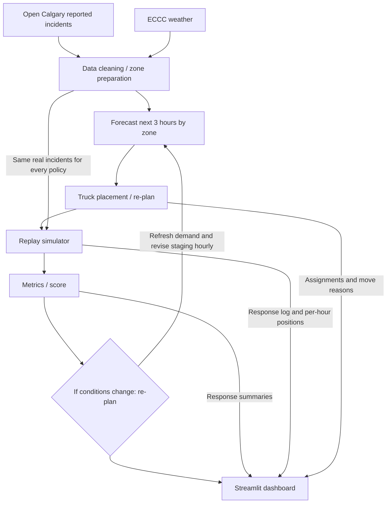

# StormStage architecture specification

This is the architecture intended for judges, with unfinished components disclosed. Evidence was inspected on October 3, 2026: [README](../README.md), [pitch](pitch.md), [demo runbook](demo-runbook.md), [app.py](../app.py), [forecast.py](../forecast.py), [mock_data.py](../mock_data.py), and [zones.csv](../zones.csv). Local `main` and the working-branch base both point to `29eaa74`. The team's verified update establishes that PR #3, “Add 2025 incident cleaning pipeline,” is open and contains `src/load.py`, `data/raw/calgary_traffic_incidents_full.csv`, and `data/processed/incidents_clean.csv`. It is not merged into main or integrated into the app; it does not establish completed weather/forecast work. No other teammate work or numerical results are established here.

## Intended judge-facing flow

The architecture specification / Mermaid data-flow exists below. The final judge-facing architecture visual still needs C verification/polish before presentation. All backend arrows are planned handoffs, not proof of an integrated pipeline. Status details follow the diagram.

The intended loop is **plan → score → revise → rescore**: forecast demand, stage the fleet, evaluate through replay, then refresh demand and reconsider placement each hour, including when conditions change. A revised plan is replayed/scored again. The dashboard presents its evidence; no such loop executes in the current shell.

## Component status

Status terms: **implemented on main** means code exists on inspected local main; **present only as stub** means placeholder behavior; **waiting on teammate branch** means an assigned handoff/merge is pending, with known PR work identified explicitly where verified; **not yet integrated** means the current app does not consume real output. PR #3's presence does not verify its outputs or any other teammate implementation. A = Data & Forecast, B = Optimizer & Simulator, C = App, Voice & Pitch Lead.

| Component | Current status | Evidence and intended handoff |
| --- | --- | --- |
| Open Calgary reported incidents | **waiting on teammate branch** (A, open PR #3); **not yet integrated** | Raw and cleaned incident CSVs exist in open PR #3, not on main or in the app. Validated provenance and demo-day evidence remain pending. |
| ECCC hourly weather | **waiting on teammate branch** (A); **not yet integrated** | Calgary International weather is planned in README; no weather input, station metadata, or join pipeline is tracked on inspected main. PR #3 does not establish weather completion. |
| Data cleaning / zone preparation | **waiting on teammate branch** (A, open PR #3); **not yet integrated** as a real pipeline | Incident cleaning work exists in open PR #3 but is not yet merged or integrated. Root `zones.csv` and app zone validation/loading are **implemented on main**; PR #3 does not establish hourly weather joins or completed zone preparation. |
| Forecast next 3 hours by zone | **present only as stub**; real forecast **waiting on teammate branch** (A); **not yet integrated** | `forecast.py` explicitly returns fake demand; `baseline_forecast` is also a stub. Its input zone path is outside this checkout. App comments explicitly avoid calling it. PR #3 does not establish forecast completion. |
| Truck placement / re-plan | **waiting on teammate branch** (B); **not yet integrated** | No `place_trucks` implementation or move-cost computation is tracked. README proposes greedy placement plus one swap pass. Current assignments/reasons are fixtures. |
| Replay simulator | **waiting on teammate branch** (B); **not yet integrated** | No `simulate` implementation or per-incident response log is tracked. Nearest-free-truck dispatch is a README plan. |
| Metrics / score | **waiting on teammate branch** (B); **not yet integrated** | No `metrics(log)` implementation or measured summaries are tracked. `MOCK_METRICS` contains static illustrative values only. |
| If conditions change → re-plan | **waiting on teammate branch** (B, with A forecasts); **not yet integrated** | The hourly revise/rescore loop is planned. The fixture changes one assignment at hour 15; no optimizer, forecast refresh, or rescoring executes. |
| Streamlit dashboard | **implemented on main** as a mock shell; real outputs **not yet integrated** (C) | Zone display, comparison maps/tables, manual hour slider, mock metric cards, and mock log exist. Day selections share fixtures; Play/Pause is a placeholder. Forecast view and voice are absent. |

## Known build-plan interfaces

These are the agreed logical handoffs recorded in the task/build plan, not a claim that all functions exist. B's exact parameter lists, artifact formats, and extra fields still need confirmation; do not treat proposed details below as implemented APIs.

| Interface | Required output | Current evidence |
| --- | --- | --- |
| `forecast(day, hour, weather)` | `DataFrame: zone_id, expected_incidents` | Signature/columns exist in the forecast stub only. |
| `place_trucks(...)` | `truck_id, zone_id, reason` | Planned B handoff; no implementation on inspected main. |
| `simulate(day, policy, k)` | Per-incident response log + per-hour truck positions | Planned B handoff; no implementation on inspected main. |
| `metrics(log)` | `avg_response_min, p90_response_min, pct_within_15` | Planned B handoff; mock cards use these names but perform no calculation. |

**Forecast:** the stub documents `day` as a date or `YYYY-MM-DD`, `hour` as 0–23, and `weather` keys `snowing`, `temp_c`, and `snow_last_6h`. `expected_incidents` represents demand summed over the next three hours per zone, not observed incident counts or three separate hourly predictions. The real model must preserve these columns and align zone IDs with downstream inputs. How forecasts cross midnight and how local hours/DST are represented need A's confirmation.

**Placement:** the known output identifies each truck, its staging zone, and a one-line reason. Inputs are intentionally left as `...` until B confirms demand, fleet state, candidate zones, travel costs, and move-penalty parameters. Root zones expose `zone_id, lat, lon`. The shell currently calls trucks `unit_id`; C must map B's `truck_id` explicitly rather than assume schemas match.

**Replay:** README plans six trucks (`k = 6`) and nearest-free-truck dispatch to real reported incidents. The exact log and position schemas are pending B. To verify replay and connect the UI, the handoff needs incident identities/times and response minutes, plus hour/time, truck identity, and position/zone association. These are proposed integration requirements, not confirmed extra field names. B must document travel times, service duration, queueing/free-truck rules, relocation costs, and initial fleet state.

**Metrics:** `avg_response_min` is mean incident-to-arrival response time, `p90_response_min` is its 90th percentile, and `pct_within_15` is the percent reached within 15 minutes. B must confirm denominator, missing/unserved-incident handling, and percentile convention. The shell formats the share on a 0–100 scale; confirm that scale before integration. `relocation_count` is an additional display/handoff need, outside the three-field metrics contract; its mock value is not calculated from movements.

## Baselines and evaluation

- **Fixed staging = primary naive baseline.** Waiting locations remain fixed; trucks still dispatch under the common replay rules. Yard locations and initialization need B's documented choice.
- **Historical hotspots = optional second baseline.** README describes last week's hotspots. The current policy dropdown exposes only illustrative hotspot assignments. `baseline_forecast` is a forecast reference, not an implemented truck-placement baseline.
- Replay the **same incidents across policies**, with matching dates, fleet size, dispatch rules, travel model, service assumptions, and a documented initialization protocol. Score policy differences without changing the incident sample.
- Use only information available at each decision time. Do not use future replay incidents or held-out outcomes to choose earlier staging. A/B must define training and held-out periods.
- Show initial staging/score, the hourly revised staging and actual reason, then the revised score. Moving a mock marker does not prove the coded loop or improvement.
- README requests the demo day plus two held-out storm days. All measured outputs remain pending. Report fixed-minus-StormStage response differences in minutes and within-15 differences in percentage points; do not invent gains or hide zero/negative outcomes.

## Data meaning and presentation boundaries

Open Calgary **reported traffic incidents are not equivalent to all collisions**. The planned forecast concerns demand represented by those records; it does not establish every collision, every tow request, or operational fleet response times. A must document reporting coverage and cleaning limitations and cite the exact source and weather station.

The current app shell still uses **mock data until real outputs are integrated**. Root zone coordinates are displayed, but the gray points are locations, not incident observations or demand intensity. Static cards, fixture dates, mock snow messages, and truck assignments establish no measured forecast accuracy, policy benefit, or validated storm event. Keep the app's `MOCK / DEMO` labels visible during a shell walkthrough. The named intended user is a **roadside-assistance dispatcher / Calgary tow operator**; actual user engagement, a customer, or a partner is not verified. Proposed use and a future pilot are not customer commitments.

The Streamlit/Pandas/Pydeck shell provides a reviewable view of zones, assignments, and explanations. Separating forecast, placement, replay, and scoring handoffs is intended to let A/B/C validate outputs independently and compare policies through one replay. Efficiency, hosting cost, and operational scalability have not been measured.

## Discrepancies and remaining blockers

| Source claim / mismatch | Actual inspected state / resolution owner |
| --- | --- |
| README says to press Play and compare a real storm-day replay. | Play does not advance time; every day shares fixtures. B replay and C integration are pending. Pitch/runbook already disclose this. |
| README describes showing a response-time drop and cites daily incident/snow-day counts. | No real response logs, measured results, or supporting data provenance are tracked on inspected main. Incident files in open PR #3 do not establish these claims. A validates counts/days; B supplies measured comparisons. Treat reduction as an objective. |
| README links `data/README.md`. | That file and the real data pipeline are absent on local main. Incident cleaning work exists in open PR #3 but is not yet merged or integrated; A must supply data documentation. |
| Forecast and app expect different zone paths. | Forecast resolves to `C:/Users/adamb/data/processed/zones.csv`, outside this checkout and unavailable at inspection; app reads repository-root `zones.csv`. A must align the real data path/interface. |
| Placement contract uses `truck_id`; app fixture tables use `unit_id`. | B/C must agree an adapter and position schema before integration. |
| Mock relocation total vs displayed move. | Static fixture relocation counts are not derived from the single displayed assignment change. B supplies real counts; C replaces mock displays. |
| README heading calls this “Case 6 (Option A).” | [Organizer README](https://github.com/nagusubra/industry-hackathon-lab/blob/main/README.md) lists five prepared Software and Computational Math cases. Submit as **Option A, own problem**, without implying an official prepared Case 6. |
| Existing docs call user engagement an Option A verification item. | Organizer requires naming a user; the [rubric](https://github.com/nagusubra/industry-hackathon-lab/blob/main/JUDGING_RUBRIC.md) makes industry/mentor engagement encouraged, a bonus rather than a mandatory gate. Feedback remains pending; no relationship is verified. |

Ownership and the six-truck/three-hour design follow README and existing Role C docs. Backend status distinguishes inspected local main from the team's verified open PR #3 update; no other teammate work is established. No standalone build-plan file is tracked. Final architecture-visual verification/polish, clean-clone setup, integrated live demo, real-data/coded-cycle evidence, measured outcomes, and screenshot/recording backups remain pending. See [submission-checklist.md](submission-checklist.md) for the submission handoff. This documentation task changes no implementation or teammate files.
