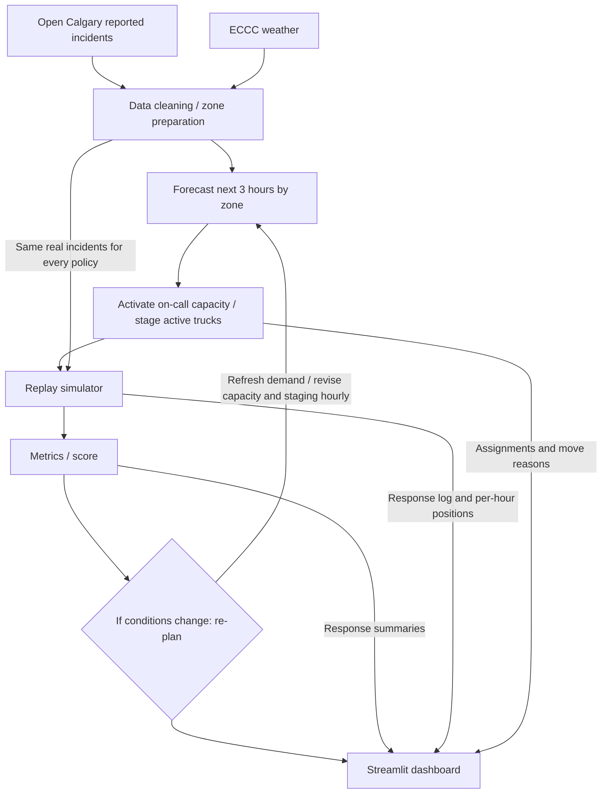

# StormStage architecture specification

Reviewed October 3, 2026 against current main (`1081dfa`), which matches this checkout. Evidence: [README](../README.md), [B implementation notes](../B_PLACEMENT_SIMULATOR.md), [interim results](../results/RESULTS.md), and the tracked backend, replay exports, and dashboard. The final design uses **6 base trucks + up to 4 additional on-call trucks**, activated when forecasted demand indicates a surge; active trucks are staged/re-staged near expected demand. Same-six-truck re-staging showed little advantage in the stand-in evaluation, prompting this policy revision. A's real weather-driven forecast is **not yet integrated**. Final weather-driven metrics remain **[PENDING]**.

## Intended judge-facing flow

The diagram describes the final weather-driven flow. Placement, replay, scoring, and precomputed dashboard handoffs exist on main using B's stand-in forecast; the real weather-driven forecast handoff remains pending. The final presentation visual still needs C review.

The loop is **plan → score → revise → rescore**: forecast demand, choose capacity and staging, evaluate through replay, refresh demand hourly, revise the plan, and score the replay outcomes. B implements hourly replanning and replay scoring. The dashboard reads precomputed evidence; moving its slider does not run an optimizer or recompute a score. Final weather-driven cycle evidence is **[PENDING]**.

## Component status

Status terms describe repository evidence, not field validation. A = Data & Forecast, B = Optimizer & Simulator, C = App, Voice & Pitch Lead.

| Component | Current status | Evidence and intended handoff |
| --- | --- | --- |
| Open Calgary reported incidents | **present and used by B replay** | Raw/cleaned CSVs and `src/load.py` are tracked. B loads raw incidents through `common.py`; the app reads exported incident responses. Final source/coverage documentation remains pending. |
| ECCC hourly weather | **raw files present**; real forecast integration **pending A** | Monthly 2025 UTC weather CSVs are tracked. `weather.py` expects `data/processed/weather_hourly.csv`, which is absent. Current replays do not use a real weather-driven forecast. |
| Data cleaning / zone preparation | **implemented on main**; final alignment **pending A/B** | B uses `data/processed/zones_grid.csv` (179 citywide zones). Root `zones.csv` has 20 downtown zones. A/B must align forecast coverage and zone IDs. |
| Forecast next 3 hours by zone | **stand-in used by B**; A's real model **pending** | `common.standin_forecast` uses history and recent incidents; `forecast.py` and `baseline_forecast` remain stubs. `forecast_adapter.py` provides the future A handoff. |
| Truck placement / re-plan | **implemented on main** | `place.py` uses greedy p-median and swaps with a move penalty. `simulate.py` stages/re-stages active trucks and activates up to 4 on-call trucks during forecast surges. |
| Replay simulator | **implemented on main**; exports **connected to app** | Nearest-arrival dispatch with responding/on-scene/returning/relocating timelines; per-incident responses and truck positions exported by `export_replay.py`. |
| Metrics / score | **interim results present** | `simulate.metrics`, `evaluate.py`, `results/RESULTS.md`, and replay `metrics.json` provide simulated response metrics and capacity costs using the stand-in forecast. |
| If conditions change → re-plan | **implemented with stand-in forecast** | Hourly forecast refresh revises capacity and staging. Final weather-driven revision/rescore evidence remains pending. |
| Streamlit dashboard | **precomputed replay integrated** (C) | `app.py` reads `replay_data.py`: day/hour-specific positions, incident responses, reasons, and full-day metrics. Play/Pause remains a placeholder; forecast visualization and voice are absent. |

## Known build-plan interfaces

These handoffs are represented in the current code. See [B implementation notes](../B_PLACEMENT_SIMULATOR.md) for full parameters and export schemas.

| Interface | Required output | Current evidence |
| --- | --- | --- |
| `forecast(day, hour, weather)` | `DataFrame: zone_id, expected_incidents` | A stub; adapter converts Calgary decision time to UTC. B currently uses its stand-in instead. |
| `place_trucks(demand, T, k, current, move_penalty_min)` | Staging sites and move reasons | Implemented in `place.py`; simulator maps sites to active units. |
| `simulate(...)`, `truck_positions(...)` | Per-incident response log, actions, and truck timelines | Implemented in `simulate.py`; exported snapshots use 5-minute steps. |
| `metrics(log)`, `replay_data.get_metrics(day, policy)` | Response metrics; exports also include relocations, activations, truck-hours | Computed interim summaries; the app displays full-day values, independent of its hour slider. |

**Forecast:** the A interface uses `day`, `hour` (0–23), and weather keys `snowing`, `temp_c`, and `snow_last_6h`. `expected_incidents` sums next-three-hour demand per zone. Raw incident/weather times stay UTC; B converts to Calgary local time (`America/Edmonton`) at the simulator boundary, and the adapter converts back to UTC for A calls. The real model must align zone IDs and preserve the interface.

**Placement:** demand, travel costs, active fleet size, current sites, and a move penalty determine staging. Exported positions use `unit_id, zone_id, lat, lon, status`; action logs supply a one-line reason per activation/move. On-call units appear only while on duty.

**Replay:** 6 base trucks plus up to 4 on-call trucks; current stand-in runs trigger the additional capacity at 2.0 times normal forecast demand. This tuning does not establish a final weather-model threshold. Dispatch uses nearest arrival, including available returning/relocating trucks at interpolated positions. Current travel assumptions are straight-line distance × 1.3 at 40 km/h, with 30 minutes on scene; these are simulation assumptions, not calibrated operating times.

**Metrics:** `avg_response_min` is mean incident-to-arrival response time, `p90_response_min` its 90th percentile, and `pct_within_15` the percent reached within 15 minutes (0–100). Also report `relocation_count`, `activations`, and `truck_hours`. Confirm denominator and percentile conventions for final reporting. Slider-visible incident rows include completed response outcomes, which may occur after the selected hour.

## Baselines and evaluation

- **Fixed yards (naive) = primary naive baseline.** Six trucks retain fixed waiting locations while dispatching under common replay rules.
- **Best fixed plan = stronger secondary comparator.** Six trucks use an optimized static spread fitted without held-out test days. Historical hotspots remains an optional diagnostic; `baseline_forecast` is a demand reference, not a truck policy.
- Replay the **same incidents across policies**, with matching dates, dispatch, travel, and service assumptions. Document initial staging and the capacity difference: baselines use 6 trucks; StormStage can use up to 10. Report truck-hours to expose that cost.
- Use only information available at each decision time. Do not use future replay incidents or held-out outcomes to choose earlier staging. Preserve the documented tune/test separation when integrating A's real forecast.
- Show initial plan/score, the hourly capacity/staging revision and recorded reason, then the revised score. The app's full-day cards do not supply per-step scores; use verified backend evidence for the coded cycle.
- B's stand-in evaluation holds out 12 storm days and 8 normal days; settings were tuned on separate days. Rerun with A's real forecast and regenerated exports before filling **[FINAL WEATHER-DRIVEN RESULTS]**. Report baseline-minus-StormStage response differences in minutes and within-15 differences in percentage points, including zero/negative outcomes.

## Data meaning and presentation boundaries

Open Calgary **reported traffic incidents are not equivalent to all collisions**. The planned forecast concerns demand represented by those records; it does not establish every collision, every tow request, or operational fleet response times. A must document reporting coverage and cleaning limitations and cite the exact source and weather station.

The app displays **PRECOMPUTED / INTERIM** stand-in replay outputs. Gray grid points are zone locations, not demand intensity. Day-specific simulated metrics are available, but establish neither final weather-driven performance nor operational gains or forecast accuracy. Keep interim labels visible. The intended user is a **roadside-assistance dispatcher / Calgary tow operator**; engagement, customers, and partners remain unverified. Proposed use and a future pilot are not commitments.

The Streamlit/Pandas/Pydeck dashboard presents zones, positions, explanations, and scores. Separate forecast, placement, replay, and scoring handoffs let A/B/C inspect evidence independently. Hosting cost and operational scalability have not been measured.

## Discrepancies and remaining blockers

| Source claim / mismatch | Actual inspected state / resolution owner |
| --- | --- |
| Final weather-driven performance is pending. | B results and replays use the stand-in forecast. A delivers the real model; B reruns evaluation/exports; C verifies the display. |
| Play/Pause and forecast visualization are incomplete. | Use the hour slider for precomputed replay. No demand layer or live optimizer runs in the dashboard. C owns presentation verification. |
| Final dataset documentation is missing. | `data/README.md` is absent. A must document sources, cleaning, coverage, time zones, and validation; B already uses incident data and C displays its replay exports. |
| A's forecast stub has a zone-path mismatch. | It resolves outside this checkout; the adapter falls back to root `zones.csv`. The dashboard uses B's `data/processed/zones_grid.csv`. A/B must align the real path/interface. |
| A forecast coverage differs from B's citywide grid. | A/B must align the 20-zone root file with B's 179-zone grid before final evaluation. |
| Submission path | **Option A, own problem using public data.** |
| Industry feedback is pending. | The named intended user is a dispatcher / Calgary tow operator. Engagement is encouraged in the [rubric](https://github.com/nagusubra/industry-hackathon-lab/blob/main/JUDGING_RUBRIC.md); no relationship or attributable quote is verified. |

The final design is 6 base trucks plus up to 4 forecast-triggered on-call trucks, using a three-hour demand horizon. Final architecture review, clean-clone setup, weather-driven cycle/results evidence, and screenshot/recording backups remain pending. See [submission-checklist.md](submission-checklist.md) for owners. This documentation task changes no implementation or teammate files.
