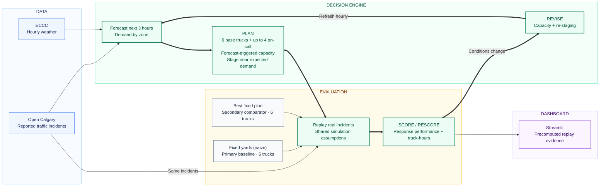

# StormStage — final design

**PLAN → SCORE → REVISE → RESCORE**

StormStage's final design uses Open Calgary reported traffic incidents and ECCC hourly weather to forecast demand by zone for the next three hours. It plans with 6 base trucks plus up to 4 forecast-triggered on-call trucks, staging active trucks near expected demand. Fixed yards (naive), the primary baseline, and Best fixed plan, the secondary comparator, each use 6 trucks and share the same incident replay and scoring assumptions. As conditions change, StormStage refreshes demand hourly, revises capacity and staging, and rescores response performance and truck-hours; Streamlit displays precomputed replay evidence.

> **Evidence status:** Current main replays/results use B's stand-in forecast; A's final weather-driven forecast integration and evaluation are pending.

[Standalone Mermaid source](architecture-diagram.mmd)
