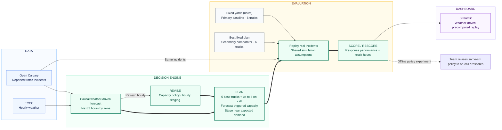

# StormStage — final design

**PLAN → SCORE → REVISE → RESCORE**

StormStage uses Open Calgary reported traffic incidents and ECCC hourly weather to forecast demand by zone for the next three hours. It plans with 6 base trucks plus up to 4 forecast-triggered on-call trucks. Fixed yards (naive), the primary baseline, and Best fixed plan, the secondary comparator, each use 6 trucks under shared replay assumptions. The backend refreshes demand and revises capacity/staging hourly; completed replay outcomes supply scores. Streamlit displays saved positions, reasons, and full-day metrics in Calgary local time, rather than executing the loop when the slider moves.

**Measured revision:** same-six-truck staging averaged 14.2 minutes and did not improve the fixed baselines. With on-call capacity, average storm-day response was 10.6 minutes versus 14.1 for Fixed yards, using 176.5 truck-hours/day versus 240 for keeping ten trucks active all day. The all-ten-truck policy was faster at 7.5 minutes. These are aggregates across 12 designated storm test days ([summary](../results/test_summary.csv)), not the Feb 4 demo-day result of 20.1 versus 9.8 minutes ([per-day results](../results/test_by_day.csv)). This is the **PLAN → SCORE → REVISE → RESCORE** policy story; response scores do not directly trigger hourly replanning.

> **Evidence boundary:** source `a` is integrated and causal: fitting stops before the requested UTC decision date. A explicitly reserves Feb 4, Feb 14, and Nov 24, plus following UTC dates. The broader all-evaluation-days exclusion claim in `results/RESULTS.md` is not established by `forecast.py`; do not repeat it. Metrics are simulated replay outcomes, not field-deployment results. Reported incidents are not all collisions or all tow calls.

The inline diagram above is the current judge-facing visual; see [architecture specification](architecture-spec.md) for interfaces and limitations.
