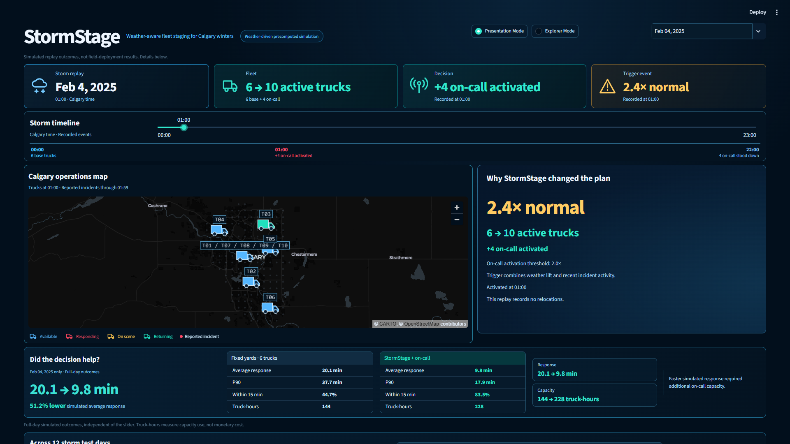
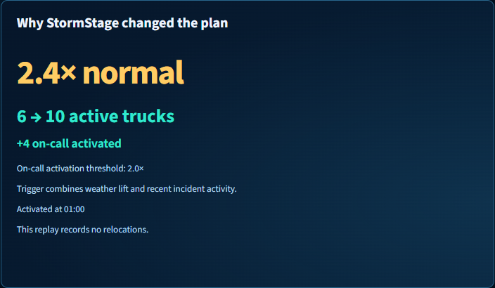
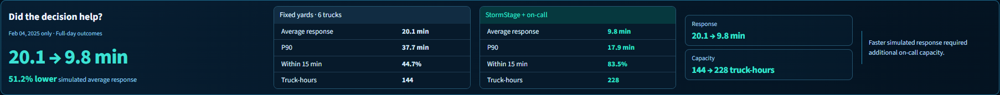
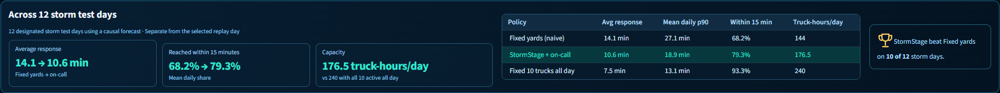
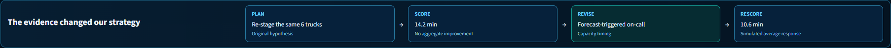

## 1. Team Name

Admest FC

## 2. Team Member Names and GitHub Handles

- Thamer Elsadek: [@Drakooz](https://github.com/Drakooz)
- Salif Sylla: [@drazox730](https://github.com/drazox730)
- Adam Bensidi: [@adam47acc-debug](https://github.com/adam47acc-debug)

## 3. Project Stream

Software and Computational Math

Option A: own problem using public data.

## 4. Project Title

StormStage

## 5. Project Short Description

Forecast-triggered on-call capacity and adaptive tow-truck staging for Calgary winter incidents.

## 6. About the Project

### Inspiration

When should a small Calgary tow and roadside fleet add capacity, and where should active trucks wait as winter conditions change? StormStage targets a **roadside-assistance dispatcher / Calgary tow operator**. It uses **6 base trucks + up to 4 forecast-triggered on-call trucks**, staging active trucks near expected demand. Open Calgary records describe **reported traffic incidents, not all collisions or all tow calls**. No customer, partner, deployment, or industry validation is established.

### What we learned

The original same-six-truck re-staging hypothesis did **not** improve fixed baselines' aggregate storm-day average response: StormStage (same 6 trucks) averaged 14.2 minutes, versus 14.1 for Fixed yards and 13.7 for Best fixed plan. The team revised the policy to forecast-triggered on-call capacity and rescored it: 10.6 minutes with 176.5 truck-hours/day. This supports capacity timing under the simulation assumptions, not a same-fleet staging improvement claim.

Fair comparison uses the same incidents, dispatch, travel, and service assumptions and reports truck-hours alongside response times. Keeping ten trucks active all day was faster at 7.5 minutes, but used 240 truck-hours/day. Traceable logs expose capacity decisions; explicit evidence boundaries keep a single demo day separate from the aggregate.

[TEAM-CONFIRMED LEARNINGS: add a brief firsthand reflection from the build; personal reflections remain unconfirmed.]

### How we built it

The integrated Python pipeline combines Open Calgary reported incidents with ECCC hourly weather. A's causal Poisson forecast estimates citywide next-three-hour demand, then allocates it to historical zone shares on the shared citywide grid. Fitting stops before the requested UTC decision date; current weather is persisted over the horizon. B's adapter computes a surge signal from weather lift and recent incidents, and the backend revises capacity and staging hourly. Placement uses greedy p-median and swaps with a move penalty; replay uses shared nearest-arrival dispatch assumptions.

**PLAN → SCORE → REVISE → RESCORE** describes the tested revision from same-six-truck staging to on-call capacity and its measured rescore. **Fixed yards (naive)** is the primary baseline; **Best fixed plan** is the stronger secondary comparator. Evaluation and regenerated replay exports use forecast source `a`.

Streamlit, Pandas, and Pydeck show precomputed positions, incident responses, decision reasons, and full-day metrics in Calgary local time (`America/Edmonton`). The dashboard reads `replay_data`; moving its slider does not rerun optimization or scoring. Presentation Mode defaults to Feb 4 at 01:00, with a manual timeline, time-correct fleet cards, operations map, decision explanation, response/capacity results, aggregate evidence, and the tested policy-revision strip. Explorer Mode retains all six policies, detailed tables, decisions, and comparison maps. Forecast intensity and voice controls are not implemented. Data preparation and limitations are documented in [data/README.md](../data/README.md).

### Challenges and evidence limits

The model allocates citywide demand to historical shares rather than learning zone-specific weather effects. Source timestamps and A's inputs are UTC, while B/C replay dates are Calgary local time. Reported incident coverage, approximate travel/service assumptions, and full-year grid geometry limit interpretation.

Evaluation uses a causal rolling-origin / out-of-time forecast. For each replay date, A fits only on information available before the requested UTC date. Earlier evaluation dates may become historical training data for later replay dates, so this is not a single frozen holdout set. `forecast.py` explicitly excludes Feb 4, Feb 14, and Nov 24 plus each following UTC date. Policy settings were selected on separate tuning days. The 12 storm and 8 normal evaluation dates were not all excluded from A's training.

## 7. Screenshots

Actual running-app captures, forecast source `a`, Feb 4, 2025 at 01:00 Calgary time. The result bands are completed full-day/aggregate simulation outcomes. [Asset provenance](../final_demo_assets/README.md) identifies the source commit and capture checks.

## 8. Demo Video / Live Site

[DEMO URL: add a judge-accessible video and/or live-site link, video preferably ≤5 minutes. Identify the weather-driven precomputed replay and simulation caveat; no URL is supplied yet.]

## 9. Additional Info

**Repository:** [Drakooz/Stormstage](https://github.com/Drakooz/Stormstage)

**Architecture:** [Specification](architecture-spec.md) and [judge-facing Mermaid visual](architecture-visual.md). The diagram distinguishes backend computation from the saved replay dashboard.

**Public data:** Open Calgary reported incidents and ECCC hourly weather for CALGARY INTL A are tracked. [Data documentation](../data/README.md) records station identifiers, UTC preparation, historical training, reserved dates, and coverage limitations. Exact incident-source/download citation and source usage terms still need owner confirmation; those checks are not claimed complete.

**Evaluation:** the same reported incidents, dispatch, travel, and service assumptions are replayed across policies. Both static comparators use six trucks; on-call uses six base trucks plus up to four extra. Shared assumptions are straight-line distance × 1.3 at 40 km/h and 30 minutes on scene. The chosen surge threshold is 2.0; the signal combines weather lift and a recent-incident nowcast. Truck-hours measure capacity use, not monetary cost savings.

**Measured weather-driven storm results:** means of per-day metrics across **12 designated storm test days using a causal forecast**, from [test_summary.csv](../results/test_summary.csv). Mean daily p90 is not a pooled incident percentile.

| Policy | Average response (min) | Mean daily p90 (min) | Mean within-15 share (%) | Truck-hours/day |
| --- | --- | --- | --- | --- |
| Fixed yards (naive): primary | 14.1 | 27.1 | 68.2 | 144 |
| Best fixed plan: secondary | 13.7 | 26.1 | 70.9 | 144 |
| StormStage (same 6 trucks) | 14.2 | 27.1 | 68.8 | 144 |
| StormStage + on-call | 10.6 | 18.9 | 79.3 | 176.5 |
| Fixed 10 trucks all day | 7.5 | 13.1 | 93.3 | 240 |

StormStage + on-call beat Fixed yards on **10 of 12** storm days and Best fixed plan on **8 of 12**, by lower daily average response ([RESULTS.md](../results/RESULTS.md)). It improved simulated average response against Fixed yards while using less capacity than ten trucks all day; it did not match that all-day policy's faster response. Same-six-truck staging did not improve the fixed baselines' aggregate average response.

**Feb 4 demo day only:** Fixed yards averaged **20.1 minutes**, versus **9.8** for on-call ([per-day results](../results/test_by_day.csv), [replay metrics](../data/processed/replay/2025-02-04/metrics.json)). The recorded activation is at 01:00 Calgary local time; there are no relocations on that day. Its full-day dashboard cards are independent of the slider and are not the 12-day aggregate.

**Evidence:** inspected local main `03d52e6`; source `a` evaluation, [response results by day](../results/test_by_day.csv), [Feb 4 action log](../data/processed/replay/2025-02-04/stormstage_actions.csv), and [aggregate results](../results/test_summary.csv). A separately recorded evaluation run ID is not established; the commit identifies the inspected repository snapshot.

**Limits:** metrics are **simulated replay outcomes, not field-deployment results**. Response-time gains do not establish forecast accuracy, calibrated operational response, customer validation, pricing, or monetary savings. Report zero/negative results honestly and disclose extra capacity. Evaluation is causal rolling-origin, not a single frozen holdout set, as described above.

**Local setup:** Python 3.10+, `python -m pip install -r requirements.txt`, then `python -m streamlit run app.py`. Clean-clone commands/results and actual screenshot provenance are recorded in [final handoff](final-handoff.md). Final team review, any video/live link, and access checks remain team actions; see [submission checklist](submission-checklist.md).
